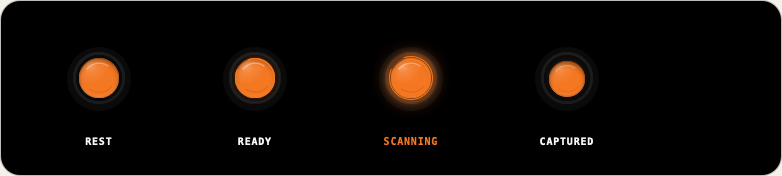
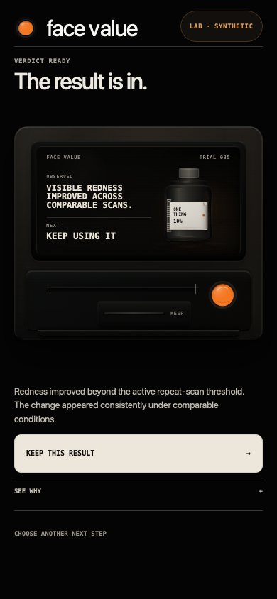
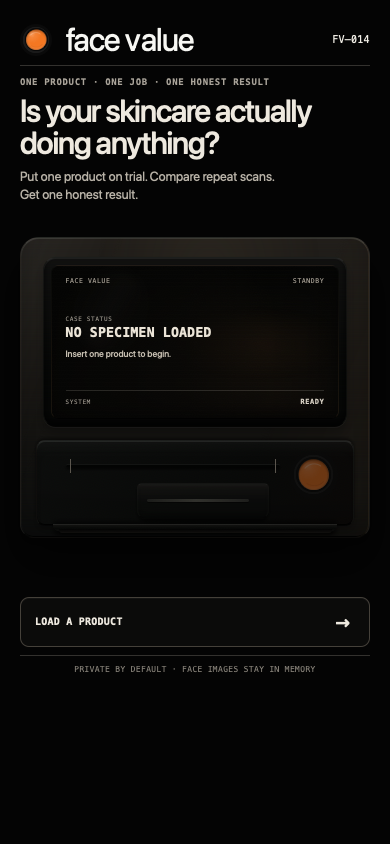
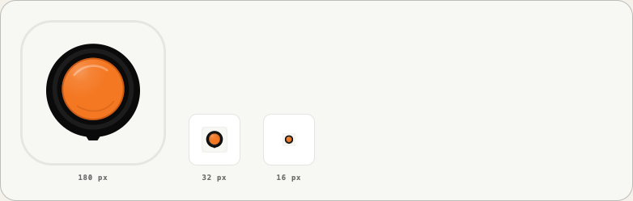
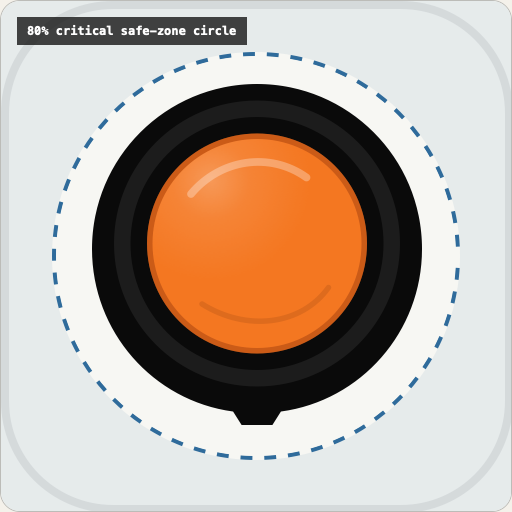
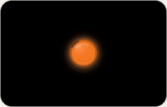

# Face Value Actuator V1.1 visual verification

Design source: Figma file `GKiVi4YJLm9WqozwAK3ThB`, primary node
`682:128`, with supporting nodes `701:40`, `683:128`, `686:198`, and
`681:102`. Code Connect was unavailable for the account tier, so the exported
Figma Design-to-Code layers and measurements are the source of truth.

## Visual evidence

### Canonical 64 px states

The recorded browser geometry matches the Figma master:

| Layer | Rest | Ready | Scanning | Captured |
| --- | --- | --- | --- | --- |
| Housing | `0,0 64×64` | `0,0 64×64` | `0,0 64×64` | `0,0 64×64` |
| Bezel | `6,5 52×52` | `6,5 52×52` | `6,5 52×52` | `6,5 52×52` |
| Recess | `9,8 46×46` | `9,8 46×46` | `9,8 46×46` | `9,8 46×46` |
| Cap | `12,11 40×40` | `12,11 40×40` | `12,11 40×40` | `14,14 36×36` |
| Ring | none | `10,9 44×44` | `8,7 48×48` | none |

Each state renders exactly one gloss layer. Scanning is the only state with
`data-actuator-active="true"`.

### Existing physical machine control at iPhone viewport

The existing amber-control wrapper remains the single button and measures
`48×48` at a `390×844` viewport. The idle control remains disabled with
`tabindex="-1"`; the enabled Ready control remains focusable, carries the
accessible name `Keep this result`, and maps to the Ready actuator. The
preserved disabled wrapper opacity makes disabled Rest and follow-up Ready
controls intentionally dimmer than the enabled Ready state.

### Rest-state brand and icon surface

The lockups use the Rest actuator and lowercase `face value` wordmark. The
180 px app icon, 32 px favicon, 16 px favicon rendering, and maskable icon all
use the Rest state. The maskable icon's critical artwork is 352 px on a 512 px
canvas and fits inside the standard 409.6 px (80%) critical circle.

### Reduced motion

With `prefers-reduced-motion: reduce`, the scanning ring has no animation and
the cap has a `0s` transition duration.

## State mapping

| Actuator state | Oracle amber states |
| --- | --- |
| Rest | `idle`, `trial-pending` |
| Ready | `ready`, `baseline-ready`, `followup-ready`, `specimen-verified` |
| Scanning | `specimen-preparing`, `specimen-registering`, `specimen-processing`, `transmitting` |
| Captured | `committed`, `dispensing`, `complete`, `latest` |

## Bounded variances and deployment follow-up

- QA labels and surrounding backgrounds are test-harness presentation only;
  the actuator layers are the exact Figma exports at the measured geometry.
- Disabled physical controls retain the pre-existing wrapper opacity and can
  appear dimmer than the standalone canonical state artwork.
- Local checks verify the linked assets, manifest, dimensions, rendering, and
  maskable safe zone. Browser-tab and iOS home-screen behavior on the deployed
  production URL still require cache-busted post-deployment verification; this
  evidence does not claim that deployment has occurred.

Machine-readable measurements are in
[`visual-qa-metrics.json`](./visual-qa-metrics.json).
